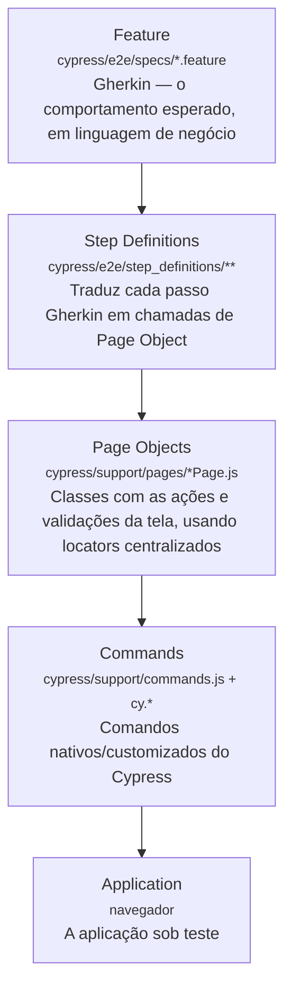

# Cypress BDD Automation Framework

## Overview
Test automation framework built using Cypress and Cucumber following BDD practices.

## Features
- BDD with Gherkin
- Page Object Model
- Data-driven tests
- CI/CD with GitHub Actions
- Reports generation
- Screenshots and videos
- Test evidence

## Tech Stack
- Cypress
- Cucumber
- JavaScript
- GitHub Actions
- Faker

## Installation

npm install

## Execution

npm run test

## CI Pipeline

Link da pipeline

## Test Architecture

O framework segue uma arquitetura em camadas, isolando o que o teste **descreve** (linguagem de negócio) do que ele **executa** (interação com a aplicação). Isso permite que qualquer pessoa do time (QA, dev, PO) leia o comportamento esperado sem conhecer Cypress, e que mudanças de UI sejam corrigidas em um único lugar (Page Object) sem tocar nos cenários.

| Camada | Local | Responsabilidade |
|---|---|---|
| Feature | `cypress/e2e/specs/*.feature` | Cenários em Gherkin (Given/When/Then), a especificação do comportamento |
| Step Definitions | `cypress/e2e/step_definitions/**` | Liga cada passo do Gherkin a um método de Page Object (ex: `loginSteps.js` chama `LoginPage.login(...)`) |
| Page Objects | `cypress/support/pages/*Page.js` | Classes que encapsulam ações da tela (ex: `LoginPage.js`, `ContaPage.js`), usando locators de `cypress/support/enum/enumLocators.js` |
| Commands | `cypress/support/commands.js` | Comandos nativos (`cy.get`, `cy.visit`, `cy.type`) e customizados do Cypress |
| Application | Navegador | A aplicação real sendo validada |

**Por que essa separação importa:**
- Um `.feature` não conhece seletores nem comandos Cypress — só descreve comportamento.
- Um Step Definition não sabe *como* a tela funciona, só *o que* deve acontecer — ele chama um método do Page Object (ex: `LoginPage.login(usuario, senha)`), nunca `cy.get(...)` diretamente.
- Um Page Object concentra os locators e ações de uma tela — se a UI mudar, o ajuste é feito em um único arquivo.
- Commands isola o acoplamento com o framework Cypress, permitindo customizações reutilizáveis em todos os testes.